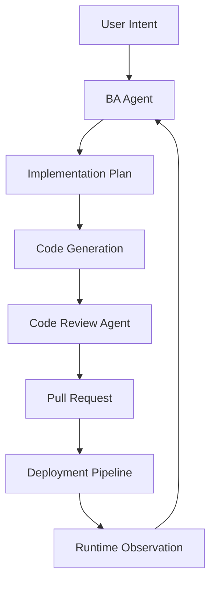

Revolte is engineered as a distributed AI orchestration platform. Rather than relying on a single general-purpose model, the system coordinates a fleet of specialized AI agents, each designed to own a specific domain within the engineering lifecycle. By integrating these agents directly into your repositories, deployment pipelines, and operational monitoring, Revolte transforms high-level intent into verified production changes with enterprise-grade reliability.

## Distributed Engineering Intelligence

AI Agents in Revolte are not standalone chatbots; they are workflow-aware orchestration systems. Each agent is purpose-built to execute reasoning within a specific boundary—whether that is refining a business requirement, validating architectural patterns, or optimizing infrastructure deployments.

These agents collaborate through shared context and state, moving a change from a raw concept to a monitored production release:

- **Requirement Analysis**: Refining ambiguous prompts into actionable implementation plans.
- **Validation**: Running semantic checks against repository conventions and style guides.
- **Deployment Reasoning**: Assessing environment health and deployment readiness.
- **Operational Control**: Analyzing runtime logs to detect anomalies and suggest implementation-level fixes.

## The Case for Specialization

Modern software engineering requires a high degree of precision across disconnected domains. A generalized model lacks the operational depth needed for enterprise governance. Revolte's multi-agent architecture improves delivery outcomes through:

- **Accuracy**: Agents operate with domain-specific prompts and tools, reducing hallucinations and increasing implementation precision.
- **Reliability**: Specialized validation agents act as quality gates, ensuring that generated code is tested and compliant before review.
- **Governance**: Every agent action is traceable, allowing teams to audit the reasoning behind implementation choices and deployment decisions.
- **Traceability**: By separating intent from implementation, Revolte provides a clear lineage of how a requirement became a pull request.

## Active Agents

The following specialized systems are currently integrated into the Revolte orchestration engine.

### Business Analyst (BA) Agent
The BA Agent bridges the gap between natural-language intent and technical implementation. It is the entry point for every build workflow.

- **Responsibilities**: Intent refinement, implementation planning, and acceptance criteria preparation.
- **Workflow Fit**: Operates during the initial **Intent -> Build** phase so engineering work starts from clear requirements.

### Code Review Agent
The Code Review Agent acts as an automated peer reviewer, enforcing quality and consistency across the codebase.

- **Responsibilities**: Semantic code analysis, repository convention validation, and architectural verification.
- **Workflow Fit**: Operates during the **Review** phase, preparing implementation summaries and identifying potential logic errors before human review.

## Multi-Agent Orchestration Lifecycle

Revolte manages the lifecycle of a change through a coordinated handoff between specialized systems. This orchestration keeps planning, implementation, review, deployment, and observation connected.

This lifecycle is non-linear; agents can trigger feedback loops. For example, if a **Code Review Agent** detects a logic error, it can trigger a refinement cycle with the **BA Agent** to clarify the original intent and correct the implementation before the pull request is finalized.

## Planned Agent Ecosystem

Revolte is evolving toward a fully autonomous engineering system. We are expanding our fleet to include specialized agents for every critical operational domain.

<CardGroup cols={2}>
  <Card title="QA Agent" icon="bug">
    **Automated Validation** | Focuses on regression testing, edge-case analysis, and generating complex integration test suites based on implementation plans.
  </Card>
  <Card title="DevOps Agent" icon="server">
    **Infrastructure Reasoning** | Owns infrastructure-as-code generation, deployment optimization, and environment health validation.
  </Card>
  <Card title="Security Agent" icon="shield-check">
    **Compliance & Security** | Performs vulnerability analysis, secure deployment checks, and policy-focused review.
  </Card>
  <Card title="Documentation Agent" icon="book-sparkles">
    **Technical Documentation** | Automatically maintains API references, internal guides, and workflow documentation in sync with repository changes.
  </Card>
</CardGroup>

## Why Orchestration Matters

Traditional engineering workflows rely on disconnected tooling and manual context-switching. Generalized AI systems, while powerful, lack the operational specialization required to manage production systems safely.

Revolte differentiates itself by **distributing engineering reasoning** across coordinated agents. This architecture provides:

- **Scalability**: Automate the repetitive parts of the review and build cycle without sacrificing quality.
- **Governance**: Enforce organizational standards across every commit and deployment automatically.
- **Delivery Confidence**: Give every pull request semantic review and validation against your repository context.

## Next Steps

Explore how Revolte agents integrate with your specific workflows:

<CardGroup cols={2}>
  <Card title="Build Workflows" icon="hammer" href="/docs/build/quick-start">
    Learn how the BA and Code Review agents prepare implementation-ready code.
  </Card>
  <Card title="Deployment Systems" icon="rocket" href="/docs/deploy/quick-start">
    Understand how Revolte manages the path to production.
  </Card>
  <Card title="Runtime Monitoring" icon="monitor-waveform" href="/docs/observe/quick-start">
    See how AI-powered observation improves operational visibility.
  </Card>
  <Card title="Enterprise Governance" icon="building" href="/docs/control/users-roles">
    Configure roles, permissions, and security standards for your organization.
  </Card>
</CardGroup>
