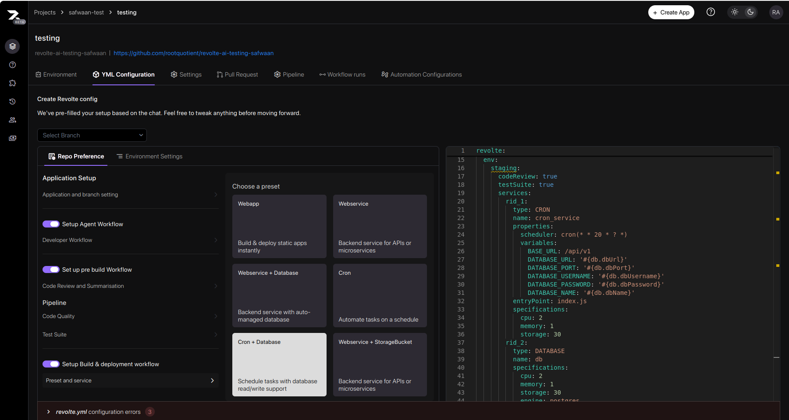
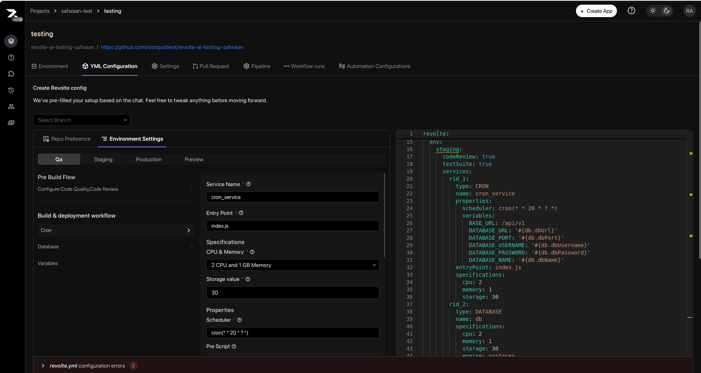
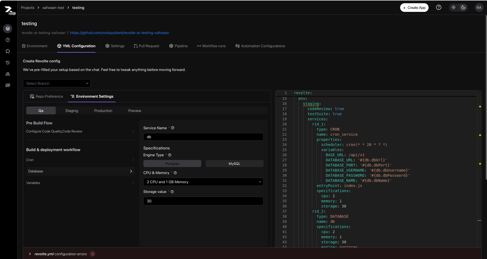
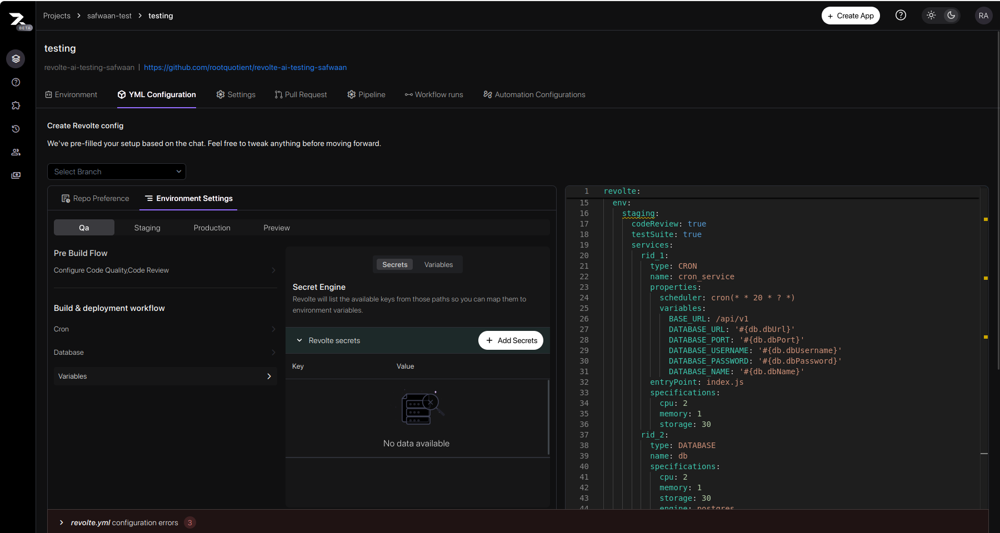

This guide walks through configuring a Cron service with an attached Database in Revolte step by step.

<Steps>
  <Step title="Choose a Preset">
    

    The preset chooser shows a grid of service options. The **Cron + Database** tile is highlighted. Click **Cron + Database** to continue.
  </Step>

  <Step title="Repo Preference">
    Configure the following sections in the **Repo Preference** tab:

    **Application Setup** — Select your application and the branch to deploy from.

    **Setup Agent Workflow** — Toggle on to enable automated developer workflows. When enabled:
    - **Developer Workflow** — Toggle on to activate the agent-driven workflow for your service.
    - **Enabled** — Toggle on to make the workflow active.

    **Set up pre build Workflow** — Toggle on to enable code review and summarization before each build. When enabled:
    - **Summarize** — Toggle on to generate an AI summary of code changes before each build.
    - **Suggest Fixes** — Toggle on to receive automated fix suggestions during review.
    - **Comment Style** — Choose how review comments appear: **Balanced**, **Concise**, or **Verbose**.
    - **Excludes** — Enter file names or extensions to skip from code review (e.g., `json` to exclude all JSON files).

    **Pipeline** — Configure code quality and testing:
    - **Code Quality → Code Style** — Select a code style framework. Clicking navigates to **Application and Branch Setting** above, where the framework is linked to your application.
    - **Test Suite** — Click to expand, then enter the command to run your tests (e.g., `npm test`).

    **Setup Build & deployment workflow** — Toggle on to automate build and deployment for each service in your preset.
  </Step>

  <Step title="Cron — Environment Settings">
    

    The **QA** environment tab is selected. The left sidebar shows **Cron**, **Database**, and **Variables** under Build & deployment workflow. The center panel shows the Cron form:

    - **Service Name** — Enter a unique identifier for this cron job (e.g., `cron_service`).
    - **Entry Point** — The main file executed on each cron run (e.g., `index.js`).
    - **Specifications**
      - **CPU & Memory** — Choose a compute tier for this job (e.g., `2 CPU and 1 GB Memory`).
      - **Storage value** — Disk space in GB allocated to the job (e.g., `30`).
    - **Properties**
      - **Scheduler** — Enter a cron expression to set when the job runs (e.g., `cron(* 20 * ? *)`).
    - **Pre Script** — Commands to run before the job executes. Click **+ Add** to add a script.
    - **Insights** — Select system metrics to monitor:
      - **Cpu** — Options: idle, user, system.
      - **Swap** — Options: swap usage.
      - **Memory** — Options: total memory used, free memory.
      - **Disk** — Options: disk used, disk total, disk free.
  </Step>

  <Step title="Database — Environment Settings">
    

    The **QA** environment tab is selected with the **Database** tab active. The left sidebar shows **Cron**, **Database**, and **Variables**. The center panel shows the Database form:

    - **Service Name** — Enter a unique identifier for this database instance (e.g., `my_database`).
    - **Specifications**
      - **Engine Type** — Select the database engine to use (e.g., MySQL, PostgreSQL).
      - **CPU & Memory** — Choose a resource tier that matches your workload (e.g., `2 CPU and 1 GB Memory`).
    - **Storage value** — Disk space in GB allocated to the database (e.g., `30`).
  </Step>

  <Step title="Variables & Secrets">
    

    The **QA** environment tab is selected with the **Secrets** sub-tab active. The left sidebar shows **Cron**, **Database**, and **Variables**. The center panel shows:

    - **Secret Engine** — **Revolte secrets** is the built-in provider for storing encrypted key-value pairs.
    - **Add Secrets** button — Click to add a secret. Enter a key (e.g., `DATABASE_URL`) and its value (e.g., a connection string or API key).
    - Secrets appear as rows in the table once added. The table is empty until the first secret is created.
  </Step>

  <Step title="Commit">
    At the bottom of the panel, fill in the **Commit Details**:

    - **File Name** — The configuration file to create or update in your repository (e.g., `revolte.yml`).
    - **Commit Message** — A short description of what you configured (e.g., `Add cron service with database`).
    - **Choose Branch** — The branch where the configuration file will be committed.

    Click **Commit** to save the configuration to your repository, or **Skip & deploy** to deploy immediately without committing.
  </Step>
</Steps>

> **Tip:** Always commit with a clear message before deploying to keep a traceable configuration history.
