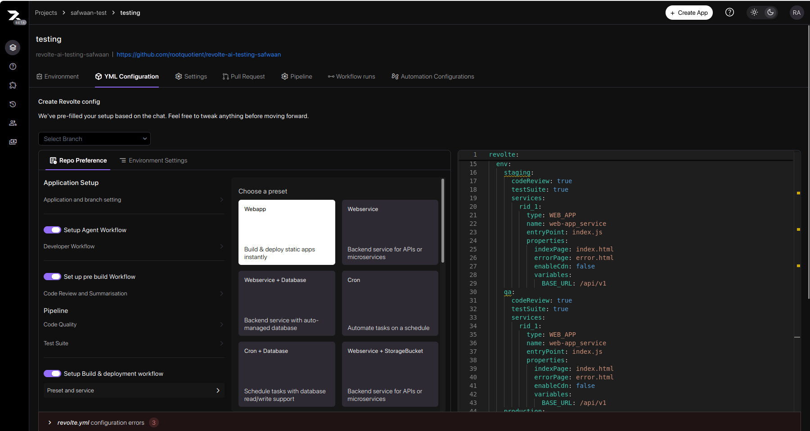
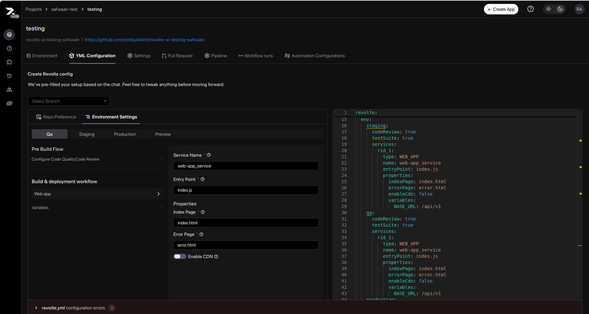
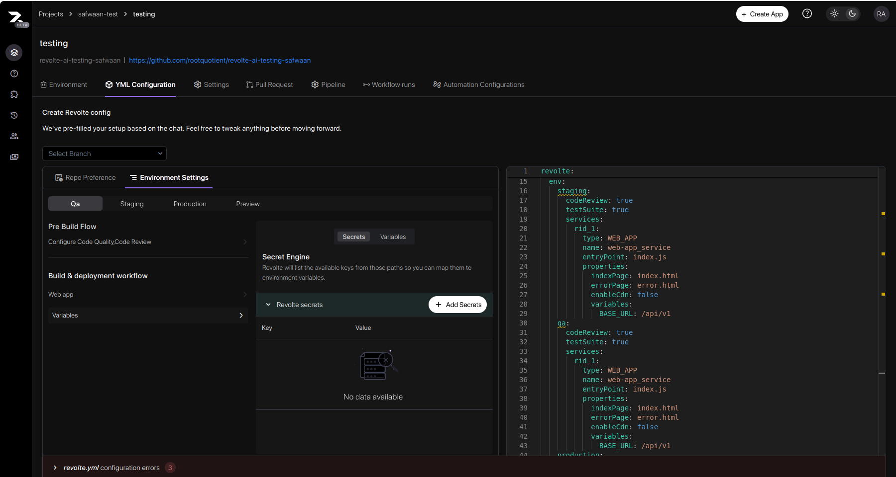

This guide walks through configuring the first Web app service in Revolte, focusing on the Repo Preference and Environment Settings steps. Each section includes annotated explanations and visual references to help you set up your application confidently.

## Prerequisites

Before you configure this preset, make sure you have:

- A Revolte workspace with an application created
- Repository access for the target application
- Permission to edit YAML configuration and commit changes
- Environment-specific values for QA, staging, production, and preview

<Steps>
  <Step title="Choose a Preset">
    

    The preset chooser shows a grid of service options. The **Webapp** tile is highlighted, described as "Build & deploy static apps instantly." Other visible tiles include Webservice, Webservice + Database, Cron, and Webservice + StorageBucket. Click **Webapp** to continue.
  </Step>

  <Step title="Repo Preference">
    Configure the following sections in the **Repo Preference** tab:

    **Application Setup** — Select your application and the branch to deploy from.

    **Setup Agent Workflow** — Toggle on to enable automated developer workflows. When enabled:
    - **Developer Workflow** — Toggle on to activate the agent-driven workflow for your service.
    - **Enabled** — Toggle on to make the workflow active.

    **Set up pre build Workflow** — Toggle on to enable code review and summarization before each build. When enabled:
    - **Summarize** — Toggle on to generate an AI summary of code changes before each build.
    - **Suggest Fixes** — Toggle on to receive automated fix suggestions during review.
    - **Comment Style** — Choose how review comments appear: **Balanced**, **Concise**, or **Verbose**.
    - **Excludes** — Enter file names or extensions to skip from code review (e.g., `json` to exclude all JSON files).

    **Pipeline** — Configure code quality and testing:
    - **Code Quality → Code Style** — Select a code style framework. Clicking navigates to **Application and Branch Setting** above, where the framework is linked to your application.
    - **Test Suite** — Click to expand, then enter the command to run your tests (e.g., `npm test`).

    **Setup Build & deployment workflow** — Toggle on to automate build and deployment for each service in your preset.
  </Step>

  <Step title="Web App — Environment Settings">
    

    The **QA** environment tab is selected. The left sidebar shows **Web app** and **Variables** under Build & deployment workflow. The center panel shows the Web App form:

    - **Service Name** — Enter a unique identifier for this service (e.g., `web-app_service`).
    - **Entry Point** — The main file that starts the app (e.g., `index.js`).
    - **Properties**
      - **Index Page** — The default HTML page served to users (e.g., `index.html`).
      - **Error Page** — The fallback page shown when an error occurs (e.g., `error.html`).
      - **Enable CDN** — Toggle on to serve assets through a content delivery network for faster load times.
  </Step>

  <Step title="Variables & Secrets">
    

    The **QA** environment tab is selected and the **Secrets** sub-tab is active. The center panel shows:

    - **Secret Engine** — **Revolte secrets** is the built-in provider for storing encrypted key-value pairs.
    - **Add Secrets** button — Click to add a secret. Enter a key (e.g., `DATABASE_URL`) and its value (e.g., a connection string or API key).
    - Secrets appear as rows in the table once added. The table is empty until the first secret is created.

    Switch to the **Variables** sub-tab to add plain environment variables (e.g., `BASE_URL`).
  </Step>

  <Step title="Commit">
    At the bottom of the panel, fill in the **Commit Details**:

    - **File Name** — The configuration file to create or update in your repository (e.g., `revolte.yml`).
    - **Commit Message** — A short description of what you configured (e.g., `Add web app service`).
    - **Choose Branch** — The branch where the configuration file will be committed.

    Click **Commit** to save the configuration to your repository, or **Skip & deploy** to deploy immediately without committing.
  </Step>
</Steps>

> **Tip:** Always commit with a clear message before deploying to keep a traceable configuration history.
